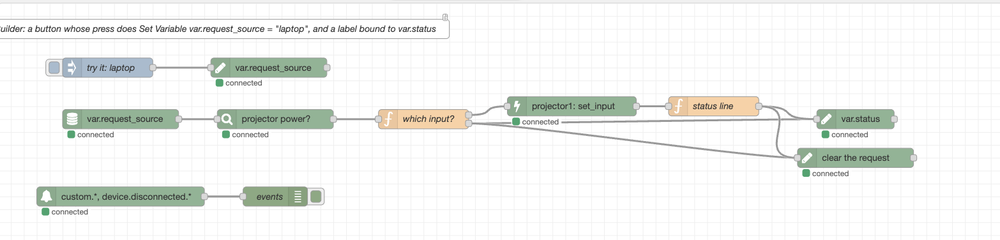

# Node-RED

[Node-RED](https://nodered.org) is a flow-based automation tool: you wire nodes together in a browser instead of writing code, and it has nodes for almost everything (calendars, building systems, databases, MQTT, HTTP, email). With the OpenAVC nodes installed, a flow can be the logic behind a space while OpenAVC keeps doing what it does: talk to the equipment, hold the room's state, and draw the touch panels.

## How the two fit together

| OpenAVC keeps | Node-RED does |
|---------------|---------------|
| Devices and drivers. A flow never speaks a projector's protocol. | The decisions. What happens when a button is pressed, a meeting starts, a sensor changes. |
| State. Every device reading and every variable, live. | Reading that state, and writing variables back. |
| Touch panels. Built in the UI Builder, bound to state as usual. | Nothing. The panel does not know where the logic lives. |
| Macros, triggers and scripts, if you still want them. | The parts you would rather draw as a flow. |

You do not have to move everything. A room can keep its System On macro and hand only the calendar logic to a flow, or hand everything over and keep no macros at all.

## The pattern

A panel button writes a variable, the flow watches the variable, the flow acts, the flow writes a status variable, the panel shows it. Nothing on the panel side is Node-RED specific.

1. In the **UI Builder**, give a button a **Set Variable** action: `var.request_source` = `hdmi1`. Bind a label's value to `var.status`.
2. In Node-RED, a **state in** node watching `var.request_source` sends a message the moment the button is pressed. Within 50 ms, in practice.
3. The flow does whatever it does: checks a room calendar, looks at an occupancy sensor, asks a building system.
4. A **command** node routes the switcher. A **set variable** node writes `Showing HDMI 1` to `var.status`.
5. The label on the panel updates. So does the same label on every other panel in the space.

The example flow that ships with the nodes (**Import › Examples › @open-avc/node-red-openavc › logic-engine**) is exactly this:



Two more examples sit beside it. **fire-a-trigger** is the reverse direction: the flow decides a meeting has started and emits an event, and a macro with an Event trigger does the sequence. **macros-do-the-sequences** is the shape most spaces want: the flow decides *when*, OpenAVC's own `system_on` and `system_off` macros do the warm-up and shut-down, and a catch node puts a failure on the panel. Each tab's description says what to set up on the OpenAVC side.

## Install the nodes

In Node-RED, open **Manage palette › Install** and search for `@open-avc/node-red-openavc`, or in your Node-RED user directory run:

```
npm install @open-avc/node-red-openavc
```

You need Node-RED 4.0 or later and OpenAVC 0.33 or later. Node-RED can run anywhere that can reach the OpenAVC system: the same computer, a server in the rack, a container.

## Connect to a system

Drag any OpenAVC node onto a flow, open it, and add a new **openavc-server**. Enter the host and port you open the Programmer on (`192.168.1.50` and `8080`, say). Tick **HTTPS** if the system has it turned on; leave **Verify the certificate** off unless the system has a cloud-issued or company certificate. Then **deploy**.

**With no API key**, the connection joins the system the way a panel does. It can read all state, send device commands, run macros, write `var.*` and `plugin.*` variables, and emit `custom.*` events. That is everything a flow needs to be the room's logic.

**With an API key**, the connection joins as the Programmer: everything above, plus every state namespace and every event on the bus. Generate a key in the Programmer under **Settings › Security**; it is stored as a Node-RED credential and never shown in the browser again.

All the nodes on one server share a single connection, and it reconnects on its own if the system restarts.

**Announce as** (optional) gives the connection a name, `lobby-logic` say. While it is connected, OpenAVC holds `system.integration.lobby-logic.connected` at `true`; when it drops, `false`. That key is how the room can tell whether the flow is there (see below).

## The nodes

| Node | What it does | Message |
|------|--------------|---------|
| **state in** | Sends a message every time a matching state key changes. Patterns like `var.*` or `device.projector.*`; `*` matches anything. Can replay current values when the connection opens. | `topic` is the key, `payload` the value |
| **event in** | Sends a message for every matching event: `custom.*`, `ui.press.*`, `device.disconnected.*`, `macro.completed.*`. | `topic` is the event, `payload` what came with it |
| **command** | Sends one command to one device and answers when the device accepts or refuses it. | `payload.success`, `payload.error` |
| **macro** | Runs a macro and answers when it has finished, however long it takes. | `payload.success`, `payload.error` |
| **set variable** | Writes a value to a `var.*` key. Every panel control bound to it updates. | `payload.success`, `payload.error` |
| **emit event** | Emits a `custom.*` event inside OpenAVC, which fires an event trigger or a script's `@on_event` handler. | `payload.success`, `payload.error` |

The **device**, **command**, **macro** and **key** fields fill their lists from the system, so you pick rather than type. That needs the server node deployed first; the dialog says so if it is not.

A command or macro that fails puts the reason on `payload.error` in the same words OpenAVC's own panel would show, and raises an error a **catch** node can pick up, so a flow can react or just log it.

## Events in both directions

State is what a room *is*; an event is something that *happened*. A flow can listen for both and cause both.

**Listening.** An **event in** node on `custom.*` hears every **Emit Event** action on a control and every Emit Event step in a macro. On `ui.press.*` it hears every button press on every panel, with the element id as the last part of the name. On `device.disconnected.*` it hears a device drop off.

**Causing.** An **emit event** node fires an event inside OpenAVC. A macro with an **Event** trigger on that name runs, and reads the payload as `$trigger.<field>`; a script's `@on_event` handler runs and reads it as `event.payload`. Names are always under `custom.`; the node adds the prefix if you leave it off. This is how a flow hands work *back* to a macro: the flow decides, the macro does the sequence.

The script editor marks a `custom.` handler that nothing in the project emits. If a flow is what emits it, that mark is telling you what the script depends on.

## Without the nodes

Everything the nodes do is ordinary API usage, so Node-RED's built-in nodes reach OpenAVC too:

- An **http request** node with an `X-API-Key` header calls any REST endpoint: `POST /api/devices/{id}/command`, `POST /api/macros/{id}/execute`, `PUT /api/state/var.status`, `POST /api/events`.
- A **websocket** client node on `ws://host:8080/ws?client=panel&events=custom.*` receives the live state stream (`state.snapshot`, then `state.update` batches) and the events named, and can send `command`, `macro.execute`, `state.set` and `event.emit` frames. Add an `X-API-Key` header to the node to connect as the Programmer.
- The **MQTT Bridge** plugin publishes chosen state keys to a broker and accepts commands back, which Node-RED's MQTT nodes speak natively.

The nodes exist because a flow should hold one socket rather than make HTTP calls (the REST API is rate-limited; the socket is not), and because picking a device from a list beats typing its id.

## If Node-RED stops

A flow that has become the room's logic is part of the room. If Node-RED is down, a button that only sets a variable still sets it, and nothing answers. Three habits keep that from being a surprise:

- Give the server node a name under **Announce as**, then use the key it publishes: bind an LED on the panel to `system.integration.<name>.connected`, add it as a [monitored reading](variables-and-state.md#monitor-a-reading) so the Dashboard and a cloud alert say when the flow is gone, or put a **State Change** trigger on it that runs a fallback macro when it turns `false`.
- Keep the sequences that must always work, System On and System Off at least, as OpenAVC macros, and have the flow *call* them with a **macro** node rather than replace them.
- Run Node-RED where it restarts on its own (a service, a container with a restart policy), on the same network segment as the system.

## Troubleshooting

- **The device or macro list is empty.** Deploy the server node first; the lists come from the system through its connection.
- **The node shows "disconnected" and the Node-RED log says the server refused the API key.** The key is wrong or was regenerated. Paste the current one from **Settings › Security**.
- **HTTPS is on and the connection never opens.** Untick **Verify the certificate** for a self-signed certificate.
- **A `set variable` node is refused.** Without an API key, only `var.*` and `plugin.*` keys can be written. Device state is written by the device's driver, never by hand.
- **An `emit event` node is refused.** Events from outside are always `custom.<name>`. The node adds the prefix; something else naming `device.` or `cloud.` events is refused on purpose.
- **`event in` shows "OpenAVC too old for events".** The system is on a version before 0.33, which had no event stream. State, commands, macros and variables still work; update the system for events.

## See Also

- [Variables and State](variables-and-state.md). The state keys a flow reads and writes.
- [Macros and Triggers](macros-and-triggers.md). Event triggers, and `$trigger.<field>`.
- [UI Builder](ui-builder.md). The **Set Variable** and **Emit Event** actions on a control.
- [Network and Security Guide](it-network-guide.md). Ports, the API key, and what a panel-posture connection may do.
